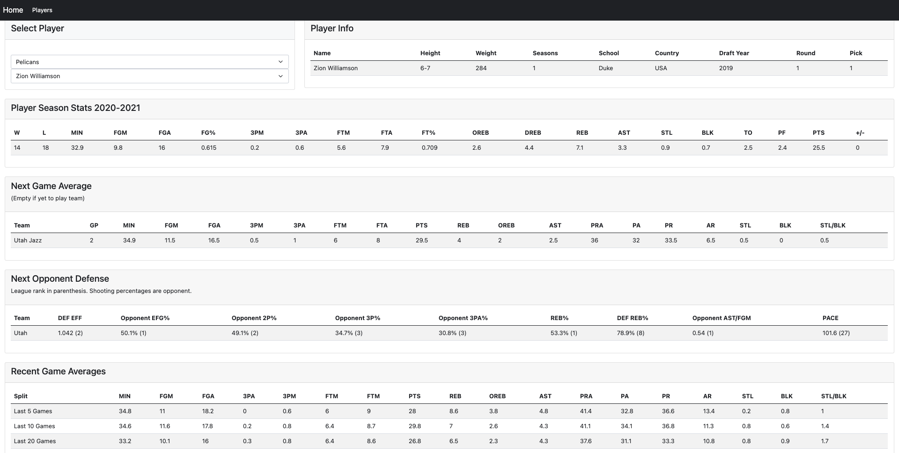
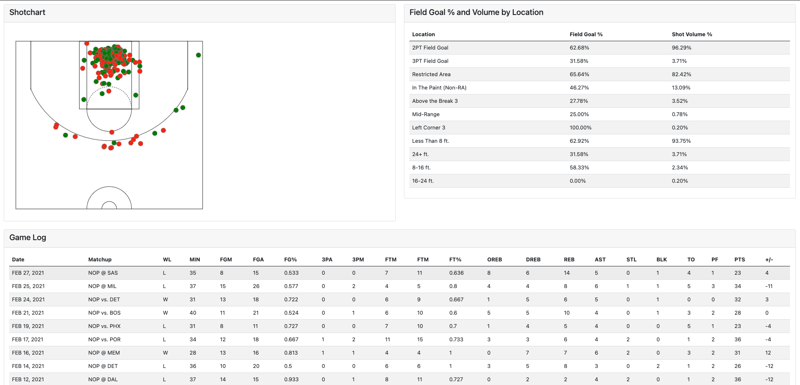

# player-dashboard

This code is a derivative of a project from class. For the NBA2019, my responsibility became the player evaluator page. That page began as a shot chart page, a way to see where players are shooting from. But as I became more in tune with the data, it became much more than that. Through the NBA API, I was able to get general player data, game log, season long, split data and so much more. 

This player dashboard first uses python to access all the data through the API. Additionally, a PostgeSQL database is set up to initiate the dropdown menus and to hold the defensive statistics. Through Javascript, HTML, and CSS I am able to display the dashboard to look like this:

The idea of the player dashboard is for player prop betting. As an amateur gambler, I was trying to find a way to use the data analysis and visualization techniques to give myself an advantage. The greatest advantage anyone can have is information that can be utilized to create informed decisions. The player dashboard aims to have just about everything you’d need to place a bet. Some of these aspects are:

-Next game opponent defensive stats

-Averages against next game opponent

-The location of the floor the player is mostly likely to shoot from (volume) and their effectiveness (FG%)

-How the player has been performing over the last 5, 10 and 20 games

The top right initiates the page, select a team and it creates a dropdown for that team, once you select a player off that list, the python app works to fetch all the data through the built APIs. 
